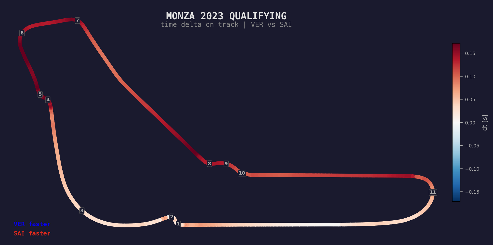
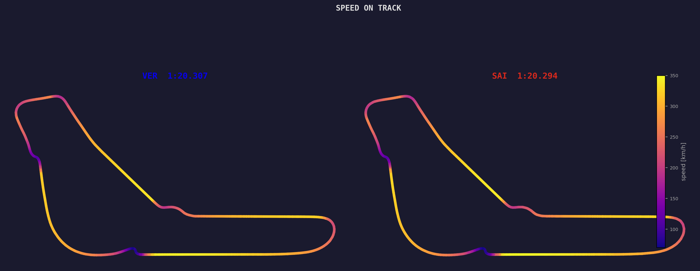
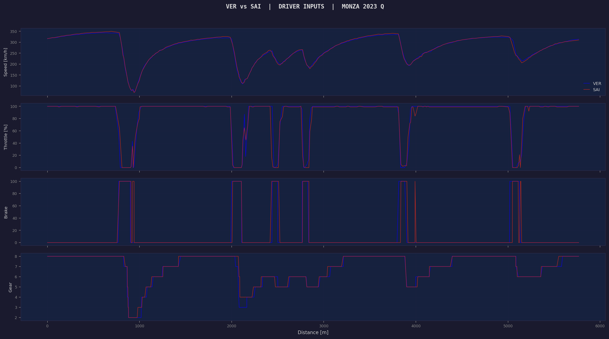
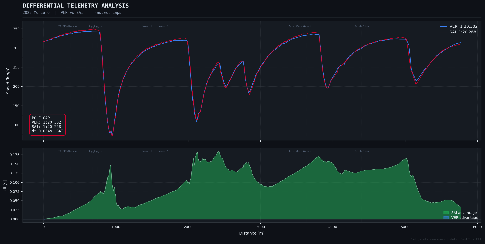

# f1-digital-twin-monza

SAI beat VER to pole at Monza 2023 by 0.013s. Both on softs, same conditions. I wanted to know where that gap actually came from, so I built a tool to find out.

It takes FIA telemetry and resamples it onto a 1-metre distance grid so you can compare two laps point by point across the whole circuit.

## where the time lives



This is the circuit layout colored by who's ahead at each point. Blue sections are where VER is faster, red is SAI. Corner numbers from the FIA circuit map.

The pattern is clear: SAI's advantage is concentrated in the braking zones (turns 1-2, the Roggia chicane, Ascari). VER gains through the faster corners (Lesmos, turn 6-7) where the RB19 generates more downforce at speed.

These gains mostly cancel out. The 0.013s pole gap is the leftover from much bigger swings in each direction.

## speed on track



Both cars colored by speed (purple = slow, yellow = fast). Top speed around 343 km/h on the main straight, dropping below 80 km/h in the chicanes. You can see why Monza is called the Temple of Speed: three long full-throttle blasts connected by tight chicane braking zones.

Colors: official 2023 Red Bull and Ferrari team colors via FastF1.

## driver inputs



This is what I find most interesting. Speed, throttle, brake, and gear for both drivers overlaid across the whole lap.

The throttle traces are nearly identical on the straights (both flat out). The differences show up in the transitions. Into T1 Grande, SAI's brake trace starts ~10m later. Through the Lesmos (around 2100-2500m), VER's minimum speed is 3-5 km/h higher because he can lean on the car's downforce through mid-speed corners.

## telemetry + delta



Top: speed traces. Bottom: cumulative time delta. Negative = VER ahead, positive = SAI ahead. The delta swings back and forth until settling at +0.019s (SAI) by the end.

Full race analysis: [docs/analysis.md](docs/analysis.md)

---

## how it works

Telemetry from FIA is time-indexed. But comparing two laps in the time domain doesn't make sense because the drivers are at different positions at the same timestamp. So you convert both to the distance domain:

1. Build piecewise-linear interpolators (distance -> elapsed time, distance -> speed) for each driver
2. Evaluate both on a shared 1-metre grid
3. `delta(d) = t_VER(d) - t_SAI(d)` at every grid point

That gives you the gap at every metre of the circuit.

## setup

```bash
git clone https://github.com/uzumakix/f1-digital-twin-monza.git
cd f1-digital-twin-monza
pip install -r requirements.txt
python main.py
```

First run downloads ~50 MB from FIA (cached after that). Switch drivers or circuits by editing the YAML config:

```bash
python main.py --config configs/spa_2023.yaml
python main.py --export csv
```

## structure

```
src/
    ingest.py       load session + extract laps (FastF1)
    resample.py     time-to-distance resampling (scipy interp1d)
    visualise.py    chart rendering
    config.py       YAML config with dataclass validation
    export.py       CSV/JSON export
tests/              25 tests, synthetic fixtures, no network needed
configs/            Monza, Spa session configs
```

## limitations

- ~240 Hz resolution ceiling from FastF1 interpolation
- No tyre degradation or compound normalization
- No fuel load correction between runs
- Corner positions from FIA circuit data (approximate)
- Track evolution across the session not modelled

[MIT](LICENSE)
