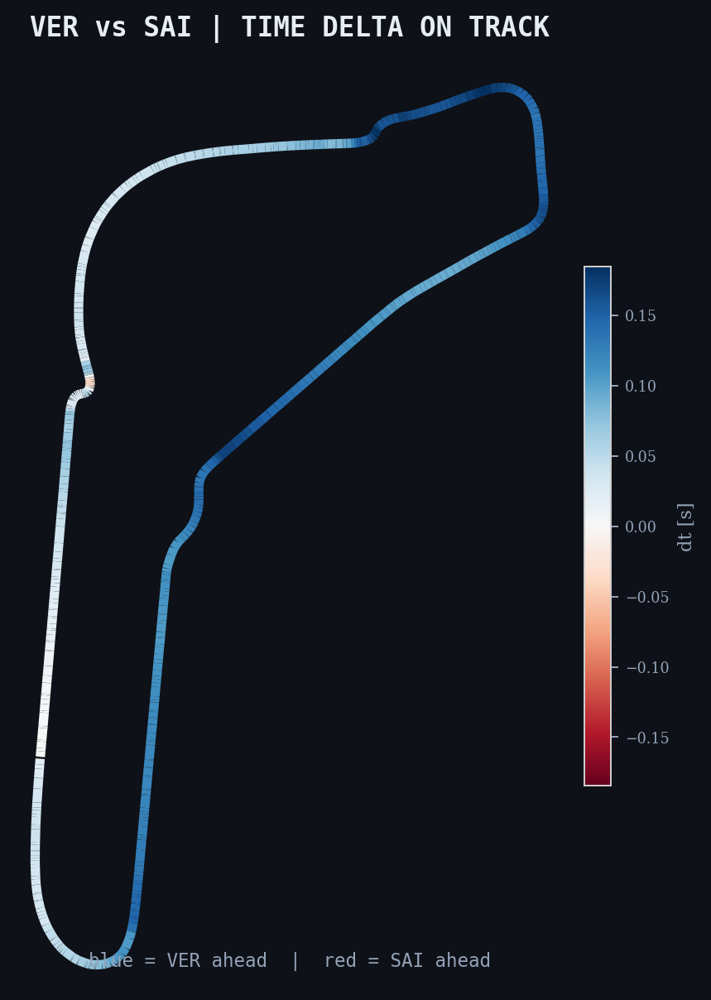
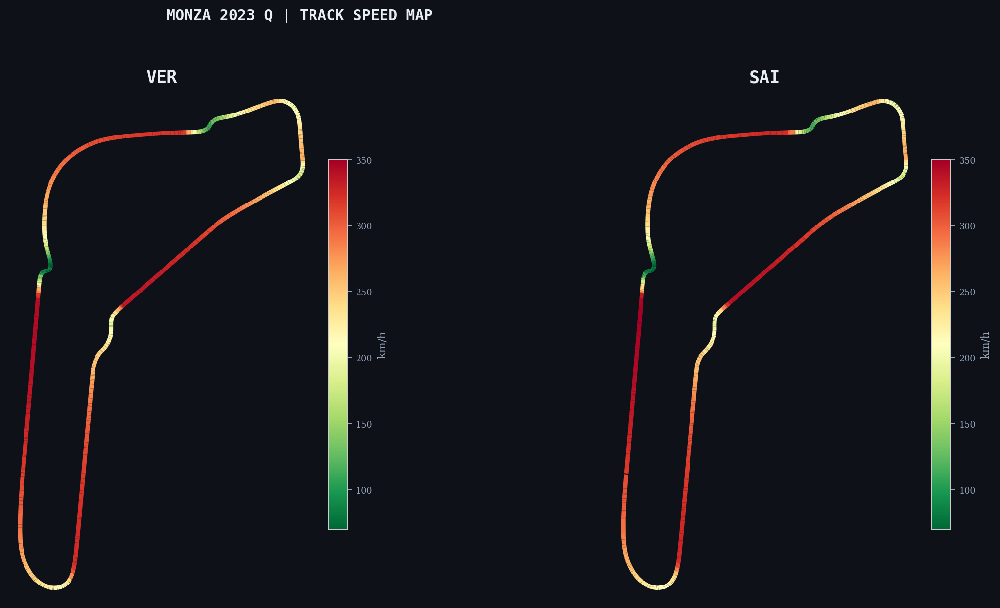

# f1-digital-twin-monza

Spatial telemetry pipeline for F1 qualifying sessions. Resamples time-domain sensor data onto a 1-metre distance grid and computes the performance delta between two drivers across the full circuit.

Default: **VER vs SAI, 2023 Italian GP Qualifying** (both on Soft compound).

## track delta map



Blue = VER faster. Red = SAI faster. The Lesmo complex (top right) is solidly blue. The chicanes are red.

## speed map



Same circuit, colored by speed. Both cars hit 343 km/h on the main straight. The chicanes drop below 80. You can see where Monza's character comes from: it's three long full-throttle zones connected by slow chicanes.

## telemetry overlay


Speed traces (top) and cumulative time delta (bottom). The delta swings back and forth as each car spends its advantages in different sectors.

## driver inputs


Speed, throttle, brake, gear for both drivers across the lap. Look at the braking zones into T1 Grande and Roggia: SAI brakes later (the red trace shifts right). Through the Lesmos, VER carries 3-5 km/h more minimum speed.

## delta trace


Final gap: **0.019s**. Pole: SAI. VER was 1:20.307, SAI was 1:20.294.

---

## how it works

Raw telemetry from FastF1 is time-indexed. To compare two laps you need them in the same domain, so the pipeline resamples both onto a shared distance grid using piecewise-linear interpolation (scipy `interp1d`). Then `delta(d) = t_VER(d) - t_SAI(d)` at every metre.

```
time-series telemetry -> interpolate to distance domain -> 1m grid -> delta computation -> charts
```

## setup

```bash
git clone https://github.com/uzumakix/f1-digital-twin-monza.git
cd f1-digital-twin-monza
pip install -r requirements.txt
python main.py
```

First run downloads ~50 MB from FIA. Cached after that.

```bash
python main.py --config configs/spa_2023.yaml   # different track
python main.py --export csv                      # dump resampled data
```

Switch drivers or circuits by editing the YAML config.

## structure

```
src/
    ingest.py       session + lap extraction (FastF1)
    resample.py     time-to-distance resampling (scipy interp1d)
    visualise.py    chart rendering
    config.py       YAML config loader
    export.py       CSV/JSON export
tests/              25 tests, synthetic fixtures, runs offline
configs/            session definitions (Monza, Spa)
docs/               race analysis
```

## tests

```bash
python -m pytest tests/ -v    # 25 passed
```

## limitations

- ~240 Hz resolution (FastF1 interpolation limit)
- No tyre compound normalization
- No fuel correction
- Corner positions hand-measured
- Track evolution not modelled

[MIT](LICENSE)
