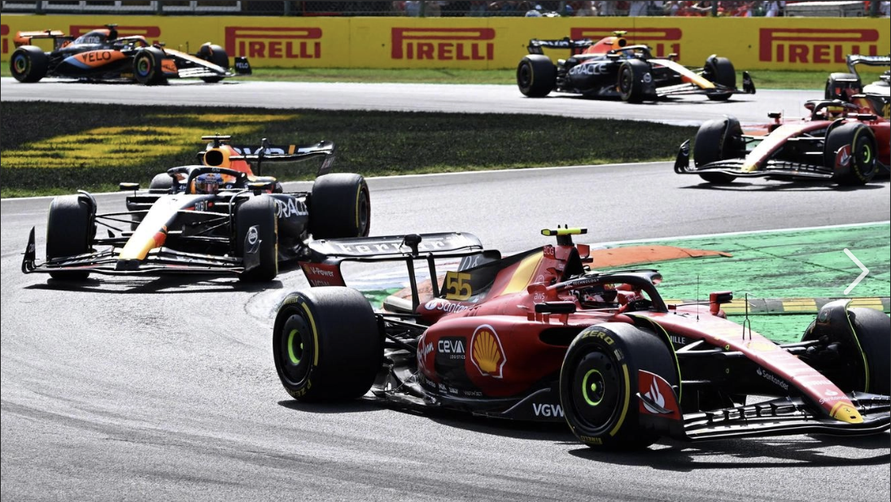

# f1-digital-twin-monza

Spatial telemetry pipeline calculating kinematic deceleration (dv/dt) into Turn 1 at Monza. Uses real FIA sensor data from the 2023 Italian GP Qualifying to compare Verstappen vs Sainz braking profiles.

## What the project finds


Sainz brakes later than Verstappen into Turn 1 and pulls harder peak deceleration. The SF-23's mechanical grip lets him commit to a later brake point and still rotate through the corner. The full speed trace and G-force overlay show exactly where and how each driver slows down from 340 km/h.

## How it works

Three steps.

1. **Ingest raw sensors.** `pipeline.py` connects to the FastF1 API and downloads speed, throttle, brake, and distance telemetry for the fastest Q laps of VER and SAI. The data comes from the FIA timing system at ~240 Hz.

2. **Apply the math.** Convert speed from km/h to m/s. Then compute the numerical derivative of velocity over time:

   ```
   a(t) = dv/dt    [m/s2]
   G = a / 9.81    [dimensionless]
   ```

   This uses `numpy.gradient` (central differences, second-order accurate). No resampling or smoothing before the derivative.

3. **Visualise the physics.** `dashboard.py` is a Streamlit app that plots speed and deceleration through the T1 braking zone (600m to 1050m). It marks the brake point for each driver and annotates peak G values.

## Project structure

```
pipeline.py         ingest + deceleration math (a = dv/dt)
dashboard.py        streamlit dashboard (interactive)
app.py              alternate streamlit dashboard
generate_plots.py   static plot generation for README
assets/
    banner.png      header image (Monza 2023)
results/
    braking_analysis.png    T1 speed + decel chart
    full_lap_speed.png      full-lap speed trace
```

## How to run the GUI

```bash
git clone https://github.com/uzumakix/f1-digital-twin-monza.git
cd f1-digital-twin-monza
pip install -r requirements.txt
streamlit run dashboard.py
```

First run downloads ~50 MB from FIA servers (cached after that).

For static plots only:

```bash
python generate_plots.py
```

## References

- Resnick, R., Halliday, D., & Walker, J. (2013). *Fundamentals of Physics*, 10th ed. Standard kinematic equations: `v = v0 + at`, `a = dv/dt`.
- Milliken, W. F. & Milliken, D. L. (1995). *Race Car Vehicle Dynamics*. SAE International. Longitudinal tire force and braking dynamics.
- Treiber, M., Hennecke, A., & Helbing, D. (2000). *Congested traffic states in empirical observations and microscopic simulations.* Physical Review E, 62(2), 1805-1824.
- FastF1 telemetry library: [theOehrly/Fast-F1](https://github.com/theOehrly/Fast-F1).

[MIT](LICENSE)
