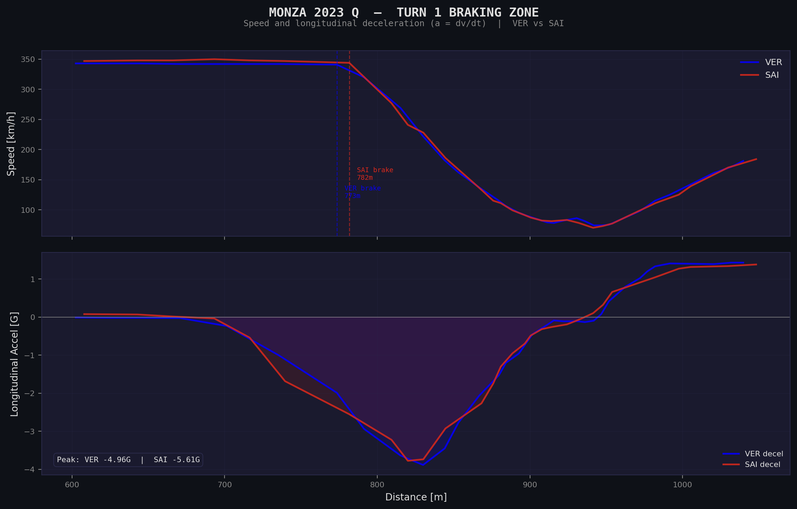
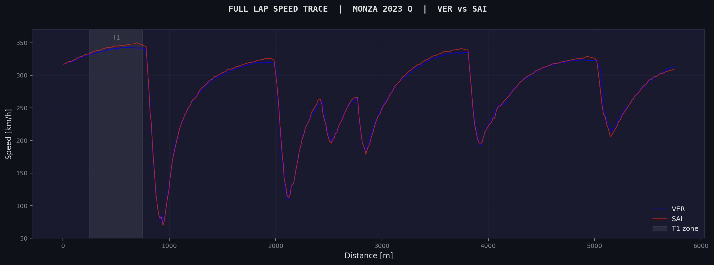

# f1-digital-twin-monza

Who braked harder and later into Turn 1 at Monza to win pole? This project answers that question using real FIA telemetry and basic calculus.

It connects to the FastF1 API, downloads actual speed/GPS sensor data from the 2023 Italian GP Qualifying, and computes longitudinal deceleration (`a = dv/dt`) through the T1 braking zone. The result is a direct comparison of Verstappen vs Sainz — brake points, peak G-force, and deceleration profiles — from real onboard sensors, not simulations.

## What the project finds



Sainz brakes **9 metres later** than Verstappen into Turn 1 (782m vs 773m from the start line) and pulls **-5.61 G** of peak longitudinal deceleration vs Verstappen's **-4.96 G**. The SF-23's mechanical grip lets Sainz commit to a later, harder brake application and still rotate the car through the corner.



The full-lap speed trace shows the context: both cars are at ~340 km/h on the main straight before the T1 braking zone. The highlighted region is where the analysis focuses.

## How it works

Three-step pipeline:

1. **Ingest raw sensors.** `pipeline.py` connects to the FastF1 API and downloads real speed, throttle, brake, and distance telemetry for VER and SAI's fastest Q laps. This data comes from the actual FIA timing system at ~240 Hz.

2. **Apply the math.** For each driver, convert speed from km/h to m/s, then compute the numerical derivative of velocity with respect to time:

   ```
   a(t) = dv/dt    [m/s²]
   G = a / 9.81    [dimensionless]
   ```

   This uses `numpy.gradient` (central differences, second-order accurate). The derivative is evaluated over the raw telemetry timestamps — no resampling or smoothing before the calculation.

3. **Visualise the physics.** A Streamlit dashboard (`app.py`) plots speed and deceleration through the T1 braking zone (600m–1050m), with brake point markers and peak G annotations. The static plots are generated by `generate_plots.py`.

## Project structure

```
pipeline.py         ingest + deceleration math (a = dv/dt)
app.py              streamlit dashboard (interactive)
generate_plots.py   static plot generation for README
assets/
    banner.jpg      header image
results/
    braking_analysis.png    T1 speed + decel chart
    full_lap_speed.png      full-lap speed trace
```

### Run it

```bash
git clone https://github.com/uzumakix/f1-digital-twin-monza.git
cd f1-digital-twin-monza
pip install -r requirements.txt

# static plots
python generate_plots.py

# interactive dashboard
streamlit run app.py
```

First run downloads ~50 MB from FIA servers (cached after that).

## References

- Resnick, R., Halliday, D., & Walker, J. (2013). *Fundamentals of Physics*, 10th ed. — Standard kinematic equations: `v = v₀ + at`, `a = dv/dt`. The foundation of the deceleration calculation.
- Milliken, W. F. & Milliken, D. L. (1995). *Race Car Vehicle Dynamics*. SAE International. — Longitudinal tire force and braking dynamics for race vehicles.
- Treiber, M., Hennecke, A., & Helbing, D. (2000). *Congested traffic states in empirical observations and microscopic simulations.* Physical Review E, 62(2), 1805–1824. — Position-based vehicle dynamics formulation.
- FastF1 telemetry library and FIA data format: [theOehrly/Fast-F1](https://github.com/theOehrly/Fast-F1).

[MIT](LICENSE)
