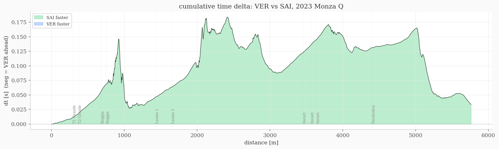

# f1-digital-twin-monza

Lap time is one number. It hides everything. This tool breaks it open.

Takes raw F1 telemetry and rebuilds the spatial performance gap between two drivers, metre by metre, across the full track. You get to see exactly where each driver gains and loses, and by how much.

Built on [FastF1](https://github.com/theOehrly/Fast-F1). Default config: VER vs SAI, 2023 Monza Qualifying.


Top: speed traces. Bottom: cumulative time delta (blue = VER ahead, green = SAI ahead). Corner markers show where the track features are.



The delta oscillates because the cars trade advantages. SAI gains in chicane braking zones. VER gains through fast corners and on the straights. The final gap (0.034s) is the residual of much bigger swings in opposite directions.

Detailed breakdown: [docs/analysis.md](docs/analysis.md)

## how it works

```
telemetry (time-indexed) -> interpolate -> resample to 1m grid -> compute dt(d) -> plot
```

The key step is domain conversion. Raw telemetry is time-indexed (a sample every few milliseconds). But comparing two laps in the time domain doesn't work because the drivers are at different track positions at the same time. So you interpolate both signals into the distance domain and evaluate them on a shared 1-metre grid. Then `delta(d) = t_A(d) - t_B(d)` gives you the gap at every point on track.

## setup

```bash
git clone https://github.com/uzumakix/f1-digital-twin-monza.git
cd f1-digital-twin-monza
pip install -r requirements.txt
python main.py
```

First run downloads ~50 MB from FIA servers. After that it's cached.

```bash
python main.py --config configs/spa_2023.yaml   # different track
python main.py --export csv                      # dump the data
python main.py --no-chart --export both          # data only
```

Sessions are configured in YAML. Switch drivers or circuits without touching code.

## structure

```
src/
    ingest.py       load session + extract fastest laps (FastF1)
    resample.py     time-to-distance resampling (scipy interp1d)
    visualise.py    chart renderer
    config.py       YAML config loader
    export.py       CSV/JSON export
tests/              synthetic fixtures, no network needed
configs/            session definitions
```

## tests

```bash
python -m pytest tests/ -v
```

25 tests. All use synthetic telemetry so they run offline. Covers interpolation, grid alignment, delta correctness, export formats.

## limitations

- ~240 Hz resolution ceiling (FastF1 interpolation)
- No tyre compound normalization
- No fuel load correction
- Corner positions hand-measured from track maps
- Track evolution not modelled

MIT
