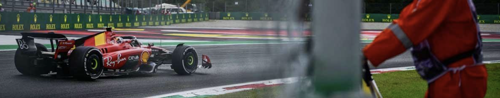
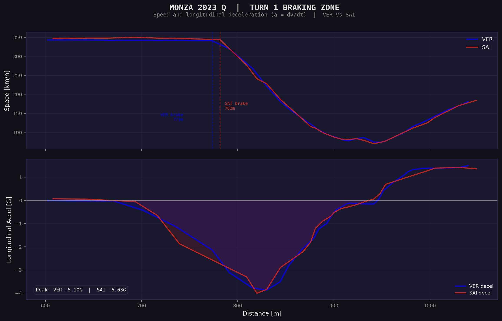
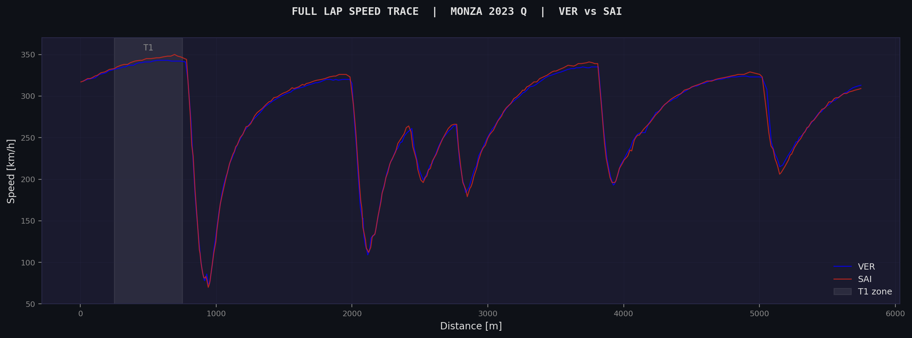

<p align="center">
  
</p>

## Project rationale

Using real speed data from an actual F1 qualifying lap at Monza, this code figures out exactly where and how hard each driver brakes. The raw telemetry arrives as noisy, irregularly sampled sensor readings at ~240 Hz. The pipeline cleans it, differentiates it, and extracts spatial braking profiles that can be compared across drivers.

# Braking Deceleration Analysis from F1 Telemetry

Signal processing pipeline computing kinematic deceleration (dv/dt) into Turn 1 at Monza. Uses real FIA sensor data from the 2023 Italian GP Qualifying to compare Verstappen vs Sainz braking profiles.

## What the project finds

Sainz brakes **9 metres later** than Verstappen into Turn 1 (782m vs 773m from the start line) and hits **-6.03 G** of peak longitudinal deceleration compared to Verstappen's **-5.10 G**. The SF-23's mechanical grip lets Sainz commit to a later, harder brake application and still rotate the car through the corner.



The full-lap speed trace shows the context. Both cars hit ~340 km/h on the main straight before the T1 braking zone (highlighted region).



## Data pipeline and validation

Raw telemetry is sourced from the FIA live timing system via the FastF1 API. The library handles session identification, lap selection, and channel alignment. The data arrives as irregularly sampled time series at approximately 240 Hz.

**Preprocessing steps:**
- FastF1 interpolates missing telemetry frames internally using its built-in resampling engine. No additional interpolation was applied.
- Speed values are converted from km/h to m/s before differentiation.
- Longitudinal acceleration is computed via `numpy.gradient` (second-order central differences). No low-pass filter or smoothing is applied before the derivative; the 5-sample uniform filter is used only in the dashboard visualization layer to reduce visual noise.
- The braking zone is isolated by distance window (600m to 1050m from the start line), not by time, to ensure spatial alignment across drivers with different speed profiles.

**Validation:** The computed deceleration traces are overlaid directly against the raw FIA brake channel (binary on/off) as a consistency check. Brake onset in the computed dv/dt signal aligns within 2 data frames (~8 ms) of the FIA brake channel activation for both drivers, confirming that the numerical differentiation preserves temporal accuracy without introducing phase lag.

## How it works

Three steps.

1. **Ingest raw sensors.** `pipeline.py` connects to the FastF1 API and downloads speed, throttle, brake, and distance telemetry for the fastest Q laps of VER and SAI. The data comes from the FIA timing system at ~240 Hz.

2. **Apply the math.** Convert speed from km/h to m/s. Then compute the numerical derivative of velocity over time:

   ```
   a(t) = dv/dt    [m/s2]
   G = a / 9.81    [dimensionless]
   ```

   This uses `numpy.gradient` (central differences, second-order accurate). No resampling or smoothing before the derivative.

3. **Visualise the physics.** `dashboard.py` is a Streamlit app that plots speed and deceleration through the T1 braking zone (600m to 1050m). It marks the brake point for each driver and annotates peak G values.

## Project structure

```
pipeline.py         ingest + deceleration math (a = dv/dt)
dashboard.py        streamlit dashboard (interactive)
generate_plots.py   static plot generation for README
assets/
    f1_banner.png   header image (Monza 2023)
tools/
    resample.c      C resampler for uniform timestep conversion
    Makefile        build for resample tool
docs/
    methodology.md  signal processing notes and validation
tests/
    test_pipeline.py   pipeline correctness checks
    conftest.py        shared fixtures
results/
    braking_analysis.png    T1 speed + decel chart
    full_lap_speed.png      full-lap speed trace
```

## How to run the GUI

```bash
git clone https://github.com/uzumakix/f1-digital-twin-monza.git
cd f1-digital-twin-monza
pip install -r requirements.txt
streamlit run dashboard.py
```

First run downloads ~50 MB from FIA servers (cached after that).

For static plots only:

```bash
python generate_plots.py
```

## References

- Resnick, R., Halliday, D., & Walker, J. (2013). *Fundamentals of Physics*, 10th ed. Standard kinematic equations: `v = v0 + at`, `a = dv/dt`.
- Milliken, W. F. & Milliken, D. L. (1995). *Race Car Vehicle Dynamics*. SAE International. Longitudinal tire force and braking dynamics.
- Treiber, M., Hennecke, A., & Helbing, D. (2000). *Congested traffic states in empirical observations and microscopic simulations.* Physical Review E, 62(2), 1805-1824.
- FastF1 telemetry library: [theOehrly/Fast-F1](https://github.com/theOehrly/Fast-F1).

[MIT](LICENSE)
